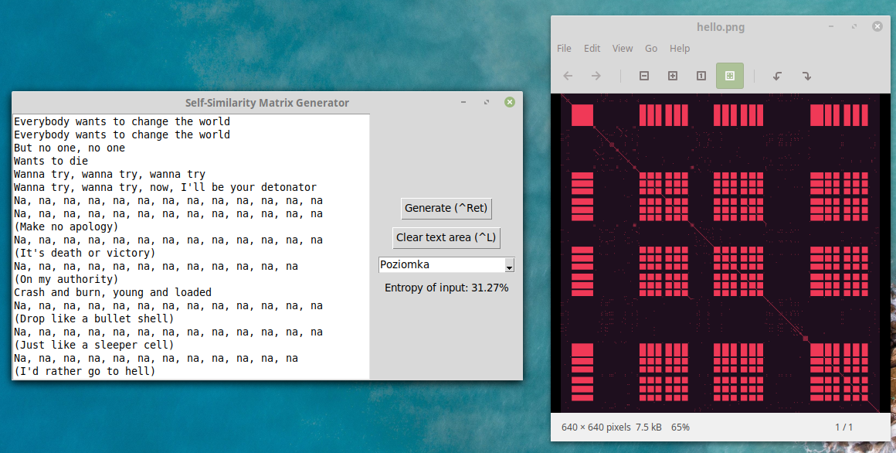

# Self-Similarity Matrix Generator

Simle script in Python+Tkinter generating self-similarity matrices for song lyrics.

Inspired by
* [Pop music stuck on repeat](https://www.youtube.com/watch?v=_tjFwcmHy5M)
* [Colin Morris's SongSim](https://colinmorris.github.io/SongSim/#/)

## Examples
### Yellow Submarine - The Beatles

### Don't Stop Me Now - Queen

### Na Na Na Na - My Chamical Romance

### Scatman

